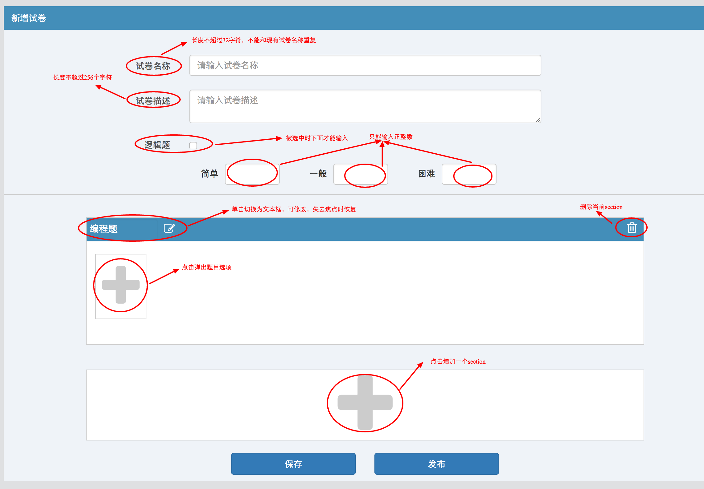

# 基于 react 的表单练习


## 运行方式
1. 在命令行中运行 
   ```
   npm run webpack
   npm start
   ```

2. 在浏览器中打开 http://localhost:3000,即可看到运行结果为红色背景的 hello world 页面


## 练习要求

**重要：本题包含四个篇目：基础，进阶，提高，出栈，做完一个篇目后，需要到 https://jinshuju.net/f/27Zpwx 提交做题记录**

### 基础篇
1. 根据图例，用 bootstrap + html 完成切图，尽量少用或者不用自定义样式(自定义样式在less中)
   

2. 使用 react + redux 完成组卷功能，要求如图例

3. 可以使用假数据，假数据为Paper信息和homeworkQuiz信息

   - 一个Paper信息

   ```json
   {
    "name": "react",
    "description": "考察react基础",
    "sections": [
      {
        "type": "logicPuzzle",
        "definition": {
          "easy": 2,
          "normal": 3,
          "hard": 4
        },
        "type": "homeworkQuiz",
        "definition": {
          "quizzes": [
            "12345" // quizId
          ]
        }
      }
    ]
   }
   ```
   - homeworkQuiz信息
   ```json
   {
    "items": [
      {
        "_id": "12345",
        "title": "react",
        "stack": "Javascript"
      },
      {
        "_id": "12346",
        "title": "jersey",
        "stack": "Java+Gradle"
      }
    ],
    "totalCount": 30
   }
   ```

   ​

### 进阶篇

1. 加入 mongoose，创建相应Model

2. 实现如下接口
   ```

   GET api/papers # 获取Papers列表
   GET api/papers/:id # 获取一张试卷
   POST api/papers/:id # 创建一个试卷
   PUT api/papers/:id #更新一个试卷
   DELETE api/papers/:id #删除一个试卷

   GET api/homeworkDefinitions #获取homeworks列表
   ```
3. 利用上述接口完成此功能

4. 完成api部分的测试

### 提升篇

1. 学习 http://airbnb.io/enzyme/ 并完成对React 的单元测试

2. 学习 Redux-Form http://redux-form.com  并用其重写页面


### 出栈篇

1. 说说你对"数据驱动视图"这个概念的理解
2. 待定...